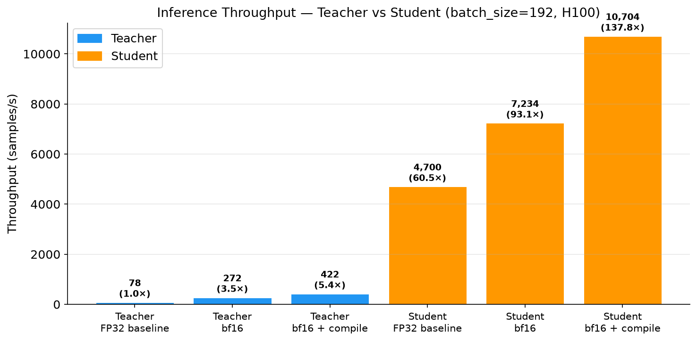
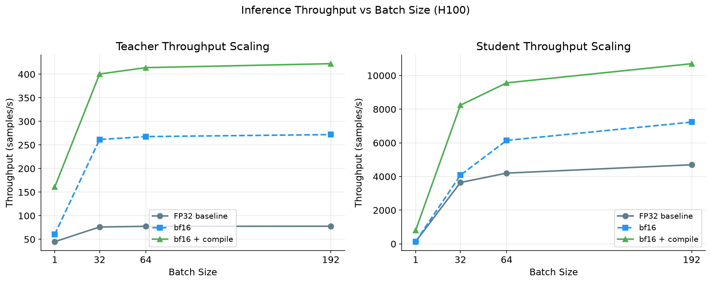
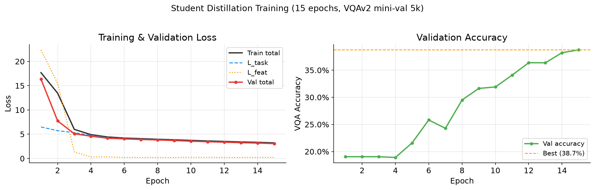

# VLM Distillation + Inference Benchmarking

Distill a frozen **Florence-2-base** (230M params) teacher into a compact **~60M param student** using attention-transfer and feature-matching losses on VQAv2. Then benchmark the student against the teacher with bf16 precision and `torch.compile` on an H100.

---

## Key Results

All numbers measured at **batch size 192 on H100 80GB**.

| Model | Optimization | VQA Acc | Latency (ms) | Throughput (samples/s) | Speedup |
|---|---|---|---|---|---|
| Teacher (Florence-2-base, 230M) | FP32 | ~55%* | 2,472 | 78 | 1.0× |
| Teacher | bf16 | ~55%* | 706 | 272 | **3.5×** |
| Teacher | bf16 + compile | ~55%* | 455 | 422 | **5.4×** |
| **Student (~60M)** | FP32 | 38.4% | 41 | 4,700 | **60×** |
| **Student (~60M)** | bf16 | 38.4% | 27 | 7,234 | **93×** |
| **Student (~60M)** | bf16 + compile | 38.4% | 18 | **10,704** | **138×** |

\* Teacher accuracy measured via linear probe on frozen Florence-2 decoder features (same 5k samples).  
**Accuracy retention: ~70% of teacher accuracy at 138× throughput.**







---

## Architecture

```
Teacher: Florence-2-base (frozen, 230M params)
  └── Microsoft seq2seq VLM: CLIP vision encoder → BART-like decoder
  └── Used only to generate cached features — never runs during training

Student VLM (~60M params, trained from scratch)
├── Vision encoder : MobileViTv2-100 (timm, pretrained, ~20M)
│     └── Input resized to 256×256 → patch features (B, S, 512)
├── Question encoder: token embedding + sinusoidal positional encoding
├── Fusion decoder  : 4× TransformerDecoderLayer (question tokens cross-attend image patches)
└── VQA head        : Linear(512 → 3,129 answer classes)

Distillation losses (applied per training step):
  L_total = 1.0 × L_task + 0.5 × L_feat
  L_task  = CrossEntropy(student_logits, majority-vote GT answer)
  L_feat  = MSE(projected student features, cached teacher decoder features)
```

**FlashAttention-2** is used automatically for the student's transformer decoder layers — PyTorch ≥ 2.2 dispatches `nn.MultiheadAttention` to `scaled_dot_product_attention` (which wraps FA-2) when inputs are bf16 on CUDA. No extra package needed.

---

## Training Setup

- **Dataset**: VQAv2 val2014 mini-val, 5,000 Q&A pairs, top-3,129 answer vocabulary
- **Teacher caching**: Florence-2-base runs once over 5k samples (~5 min on H100), intermediate decoder features saved to HDF5. Training reads from cache — teacher never runs during gradient updates.
- **Optimizer**: AdamW (lr=3e-4, weight_decay=0.01), cosine warmup 200 steps, gradient clip 1.0
- **Epochs**: 15, batch size 192 (student only, teacher cached)
- **Hardware**: NVIDIA H100 80GB, HPC Kubernetes cluster (jet scheduler)

---

## Inference Optimizations

| Optimization | Description |
|---|---|
| **bf16** | Cast model to `torch.bfloat16` — 2× memory reduction, native H100 Tensor Core support |
| **torch.compile** | `torch.compile(model, mode="reduce-overhead")` — fuses kernels, eliminates Python overhead |
| **FlashAttention-2** | Automatic via PyTorch SDPA for student; `torch.backends.cuda.enable_flash_sdp(True)` |

Student bf16 verification: `max_diff=0.07`, `argmax_agreement=100%` — numerically clean.

---

## Reproduce

```bash
# 0. Clone and install
git clone https://github.com/<you>/vlm-distillation
cd vlm-distillation
python -m venv .venv && source .venv/bin/activate
pip install -r requirements.txt

# 1. Download data (VQAv2 annotations + COCO val2014 images, ~13 GB)
python data/download_vqa.py --config configs/distil_config.yaml

# 2. Smoke test — 10 gradient steps, verifies the whole code path (~2 min)
python training/train.py --config configs/distil_config.yaml --smoke_test

# 3. Full distillation training (~25 min on H100: 5 min caching + 20 min training)
python training/train.py --config configs/distil_config.yaml

# 4. Evaluate
python eval/evaluate.py --teacher  --config configs/distil_config.yaml
python eval/evaluate.py --checkpoint checkpoints/best.pt --config configs/distil_config.yaml

# 5. Benchmark
python benchmarking/benchmark.py --config configs/distil_config.yaml

# 6. Plots
jupyter notebook notebooks/results_analysis.ipynb
```

---

## Project Structure

```
vlm_distillation/
├── configs/distil_config.yaml      # All hyperparameters
├── data/
│   ├── download_vqa.py             # Downloads VQAv2 + COCO val2014
│   └── vqa_dataset.py              # PyTorch Dataset + collate_fn
├── models/
│   ├── teacher.py                  # Florence-2 with forward hooks + HDF5 caching
│   ├── student.py                  # MobileViTv2 + 4-layer decoder + projection heads
│   └── distillation_losses.py      # L_task, L_feat, L_attn
├── training/
│   ├── train.py                    # Entry point (cache → train)
│   └── trainer.py                  # Training loop, checkpointing, history
├── eval/
│   └── evaluate.py                 # VQA accuracy (student checkpoint or teacher head)
├── benchmarking/
│   ├── benchmark.py                # Throughput / latency measurement harness
│   └── optimize.py                 # apply_optimizations(), verify_outputs()
├── notebooks/
│   └── results_analysis.ipynb      # Plots: throughput, curves, accuracy-retention
├── results/                        # Generated PNGs + CSV summary
└── jobs/                           # HPC cluster launch scripts (Kubernetes/jet)
```

---

## Design Notes

**Why feature caching?** Running 230M frozen Florence-2 every training step wastes compute. One-time caching lets training use batch size 192 on the student alone (~75% H100 memory), versus ~16 with teacher live.

**Why MobileViTv2?** Pretrained mobile-scale vision backbone gives strong ImageNet features out of the box. Cross-attention fusion over 4 decoder layers handles vision-language interaction cheaply.

**Why not flash-attn package?** The pod environment has CUDA runtime but no compiler (`nvcc`). PyTorch ≥ 2.2's built-in SDPA automatically uses FlashAttention-2 kernels when available — no build step needed.
